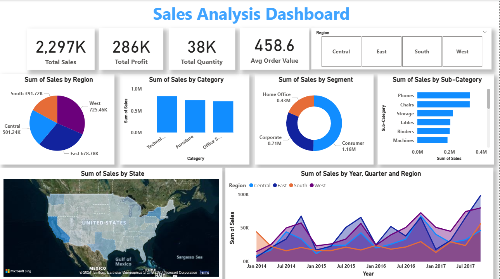

# Sales Analysis Dashboard

## 📌 Objective
This project analyzes sales data from a superstore to identify key revenue drivers, customer behaviour, and regional performance.

---

## 📊 Tools Used
- Excel / Power BI  
- Data Cleaning  
- Data Visualization  

---

## 🧹 Data Preparation
- Removed duplicates and missing values  
- Standardized category and region data  
- Created calculated metrics (Total Sales, Profit, Average Order Value)  

---

## 📈 Key Insights

### 1. Regional Performance
- West region leads in sales, indicating strong market demand or better distribution strategy compared to other regions
- South region showed lowest performance  
👉 Indicates imbalance in regional sales performance  

### 2. Category Analysis
- Technology category contributes highest revenue  
👉 Business is highly dependent on one category  

### 3. Customer Segment
- Consumer segment dominates total sales  
👉 Majority revenue comes from individual customers  

### 4. Product Analysis
- Phones and Chairs are top-performing sub-categories  
👉 Few products contribute most of the revenue  

### 5. Sales Trend
- Overall sales show growth over time  
- Fluctuations indicate inconsistent performance

### 6. Key Metrics
-Total Sales : 2.29M
-Total Profit: 286k
-Total Quality Sold : 38k
-Average Order Value: 458.6

---

## 💡 Business Recommendations

- Strengthen sales strategy in underperforming regions like south through targeted marketing
- Reduce reliance on Technology category by promoting Furniture and Offive Supplies
- Focus on high-performing products like Phones to maximize revenue
- Investigate causes of inconsistent sales trends to stablize growth

---

## 📷 Dashboard Preview

---

## 📁 Files Included
- Raw Dataset  
- Cleaned Dataset  
- Dashboard File
